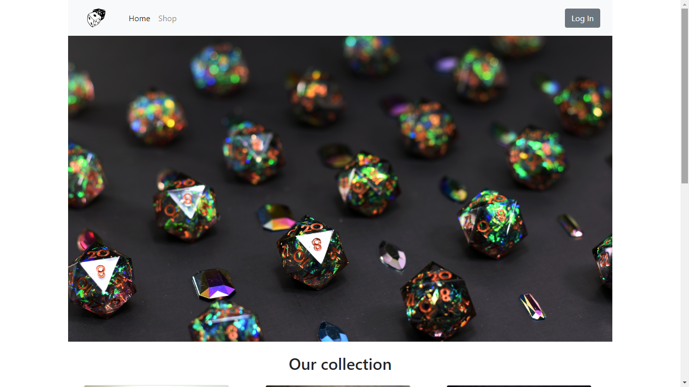

# Dice Shop
Página web que consiste en una tienda de dados para juegos de rol de mesa. 

## Base de datos

La base de datos consta de 4 tablas:

*dicesets*. Esta tabla almacena la información que se necesita sobre cada set de dados, y será de donde se conseguira la información para los productos que se mostraran en la tienda.

*user*. Esta tabla contiene los datos de los usuarios, siendo los más importantes el nickname y la password (para el inicio de sesion) y el credito (con lo que se sabra si puede o no comprar).

*receipt*. En esta tabla se guardan los datos de las facturas, almacenando solo el código de la factura y el usuario que la ha realizado junto a la fecha en la que ocurrió.

*det_receipt*. Una tabla producto de una relación m a n para almacenar los sets de dados que se han comprado junto al precio en el que se encontraban y la cantidad.

## Inicio

Al entrar en la página web el usuario se encontrará con el portal de la tienda, y si usa el enlace de la barra de navegación o baja un poco en la misma se encontrará con los productos.

Si en este momento el usuario intenta comprar algo se le redirigirá a la página de login.
## Inicio logeado

Si el usuario está logeado el boton de login desaparecera y aparecerá uno de log out, además de un carro de la compra. Además, si es un administrador aparecerá el botón de management, el cual le permitirá acceder al CRUD de la página.
## Login

El usuario será redirigido a una página de login cuando intente comprar algo sin estar logeado o al acceder a ella a traves del boton de login que aparece en la página principal. En caso de que ya este logeado se le redirigirá a la página principal.

## Registro

En caso de que el usuario no este registrado puede acceder a un formulario de registro desde la página de login, la página comprobara si existe alguien con el mismo nickname antes de permitirle registrarse, redirigiendolo al formulario en caso de que ya haya alguien con el nombre.

## CRUD

El CRUD consiste en tres secciones, una para administrar los dados que se añadiran a la tienda, otra para administrar a los usuarios y la última para ver las facturas de las comprar realizadas.

### Receipt viewer

Tambien puedes ver los detalles de las facturas

### CRUD de dados

### CRUD de usuarios

Puedes añadir usuarios o dados con el botón de *Add user* o *Add dice* que se encuentra en la parte superior, ambas páginas son iguales excepto por los campos del formulario.

## MODIFY DICE y MODIFY USER

Ambos casos son iguales, se muestran los valores actuales y permite modifcarlos.

## Carrito

Cuando el usuario añada un dado al carro de la compra podrá acceder a la página del carro, donde se le enseñará la factura y si tiene suficiente saldo podrá comprarlo, en caso de que no tenga suficiente no se le permitirá. Además de eso puede eliminar articulos del carrito.
